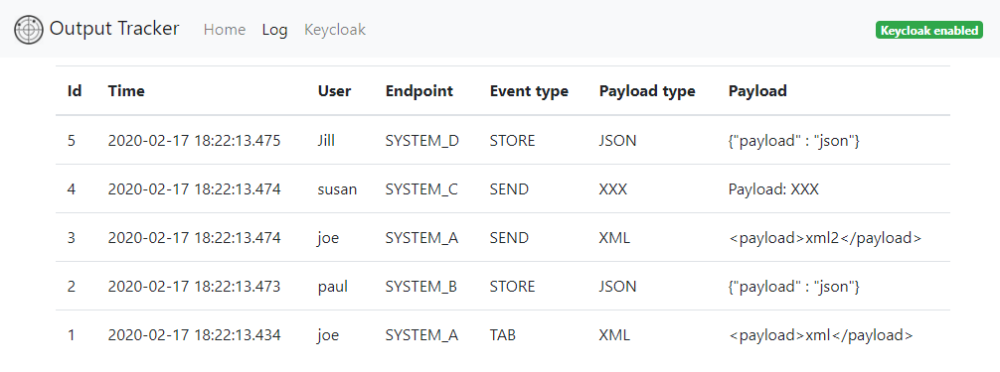
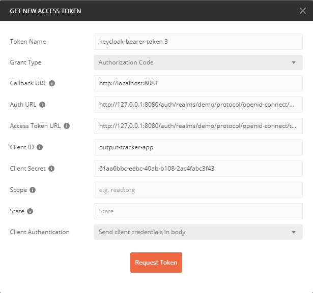

# Output Tracker
Output Tracker was made to be test replacement for an unspecified number of production endpoints. Where you in 
production will send payloads to several different systems you can now send all the different payloads to same 
endpoint. Output Tracker has a REST endpoint where you application can send the output(payload) when testing. 
Output Tracker store all received output information in a database. The tester can then open Output Trackers 
Log page. Here the tester can view all incoming outputs in order. 

:warning: **Note! Keycloak is disabled by default.**

### Requirements
(More what I have used)
* Java 13 (I think java 8 will be ok)
* Maven 3.5+
* Spring Boot 2.2.4
* Keycloak 8.0.2
* Keycloak Spring Boot Adapter 8.0.2

:warning: If Keycloack is upgraded to a newer version there is a big chance that you must update
the Keycloak Adapter aswell. This could be a big problem when you have a whole bunch of microservices.

This [article by Arun B. Chandrasekaran](https://medium.com/@bcarunmail/securing-rest-api-using-keycloak-and-spring-oauth2-6ddf3a1efcc2)
solves this problem by using Spring OAuth2 which integrates with Keycloak at protocol level (less likely to change).


## Application
The application is built with Spring Boot, Spring Data JPA, H2, Thymeleaf, Bootstrap and more.
There is a REST interface and a Web interface documented by Swagger.

### REST interface
Output Tracker has a REST api supporting POST. 
* POST url: http://localhost:8081/api/v1/log if started locally

See Swagger UI at http://localhost:8081/swagger-ui.html for Api Documentation.\
*) **Note!** Posting from Swagger will not work when `keycloak.enabled=false`

#### Payload
**Example of valid payload**
```
{
	"dateTime":"2020-02-15 03:02:22.293",
	"username":"hans",
	"endpoint":"SYSTEM_X",
	"eventType":"TAB",
	"payloadType":"XXX",
	"payload":"Payload: XXX"
}
```
 
### Web interface
You can access Output Trackers web interface from the browser at http://localhost:8081
  
#### Log view

 
## Security
The application has a layer of security by using Keycloak Identity Access Manager (IAM) for authentication and 
Authorzation.

### Keycloak
To use this application with `keycloak.enable=true` you must have a running instance of Keycloak v8.0.2 available.

Please download and start keycloak. 
How you do this is out of the scope. I assume Keycloak is running locally.
  
#### Web Admin interface
http://localhost:8080/auth/admin

#### Setup a new Realm
* Log in to Keyclock with the newly created admin user and password
* _Add realm_ `demo`. Click _create_. 
* Click _Clients_ and click _create_. Set `Client ID = output-tracker-app`. Click _save_. 
* Inside the new client set `Valid Redirect URIs = http://localhost:8081/*`. Click _save_.
* Inside the new client, click _Roles_. Create role ```user```. ~~Click _Roles_ and _add Role_. Set Role Name = user~~

* Click _Users_ and _Add user_. Pick a username of you choice.
  * Click tab _Credentials_ and give the user a password. Note the temporary password setting.
  * Click tab _Role Mappings_. In the dropdown box _Client Roles_ select _output-tracker-app_. Transfer `user` from Available Roles to Assigned Roles.

I could not make Realm Roles work so I had to add Roles to the client then add that role to the user :weary: \
Do not know why this failed me.

#### Configure Spring Boot 
* Open `application.properties`
* Set `keycloak.credentials.secret = [Keycloak Admin > Realm Settings > Keys > pick any and paste here]`

To access http://localhost:8081/log you must be authenticated.
 
 
## FAQ

### How to enable and disable Keycloak?
Open application.properties and enable/disable the property `keycloak.enable=false` or set true/false.

### What is protected by Keycloak?
For this demonstration `/log` and `/api/*`. The user must have role `user`.
Se `application.properties` for details. 
```
# Application security constraints
keycloak.securityConstraints[0].authRoles[0] = user
keycloak.securityConstraints[0].securityCollections[0].patterns[0] = /log
keycloak.securityConstraints[0].securityCollections[0].patterns[1] = /api/*
```
### How to start Keycloak?
If you downloaded and unzipped Keycloak go to keycloack-8.0.2/bin and run standalone.bat or standalone.sh.
It should now start on port 8080 by default.

### How to start the application?
* `> mvn clean install`
* `> mvn spring-boot:run`

Or start from within you favorite IDE

### How do I post to the application?
You can use Curl, Postman or write you own client and more. 
I am using [Postman](https://www.postman.com/downloads/) for testing.

#### Postman
* Select POST and provide API POST endpoint mentioned earlier in this documentation
* **Authorization:** 
** If `keycloak.enabled=false` you do not need to fill out anything for `Authorization`
** If `keycloak.enabled=true` please follow instructions for Keycloak below
* **Headers:** `Content-Type=application/json`
* **Body:** Provide a valid payload as mentioned above
* Click _SEND_. Watch for 200 Ok inside Postman. Also verify application console output.

##### When `keycloak.enabled=true`
* Inside Postman click _Authorization_
* Select TYPE = OAuth 2.0
* Click _Get New Access Token_
* Fill out the fields like shown in the picture


* Auth URL: `http://127.0.0.1:8080/auth/realms/demo/protocol/openid-connect/auth`
* Access Token URL: `http://127.0.0.1:8080/auth/realms/demo/protocol/openid-connect/auth`
* Client Secret: `[Keycloak Admin > Realm Settings > Keys > pick any and paste here]`

## TODO
* Add Spring Security
* Add Swagger support

